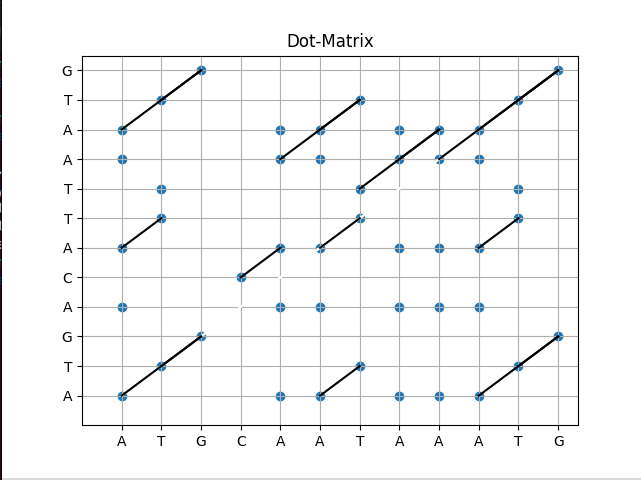

This Python code uses Matplotlib library for generating a Dot matrix. Make sure you have already installed this feature in you're PC. If you have'nt then go to the terminal and enter
***
pip install Matplotlib
***

Place You're test sequences in the text files labelled as Sequence(1 or 2).txt. and run the code.

In In Bioinformatics a dot plot is a graphical method that allows the comparison of two 
biological sequences and identify regions of close similarity between them.

A dot plot is a simple, yet intuitive way of comparing two sequences, either DNA or 
protein, and is probably the oldest way of comparing two sequences.

